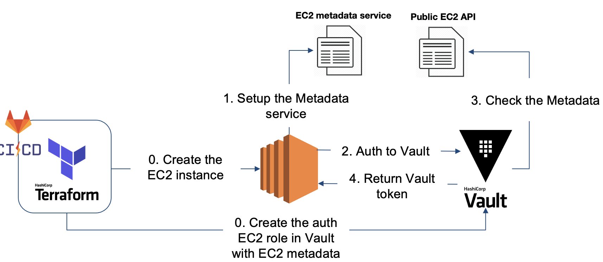

# Presentation

This Terraform folder is dedicated to deploy an application with a Vault agent to retrieve secrets seamless.
To be able to deploy this project, you should have deploy the `hcp-vault-tfc-init` repository.

## Prerequisite

Before using this repository, you should have deploy the `hcp-vault-tfc-init` repository.

## Description

This project deploy an simple application in AWS with the follow infrastructure:
- EC2 instance
- RDS mysql server

The application (wrote in PHP) run on [EC2](https://aws.amazon.com/ec2/) instance and will connect to the [RDS](https://aws.amazon.com/rds/). The application retreive the secret via the Vault Agent to the Vault server. To deploy this application a GitLab-CI is used.

The global workflow look like:

### The CI/CD

The GitLab-CI will authenticate to the Vault server via the [JWT method](https://docs.gitlab.com/ee/ci/secrets/#use-vault-secrets-in-a-ci-job) and access to secrets stored in Vault like:
  1. **Retrieve a AWS secret**: to deploy the AWS infrastructure of the application. This define in [.gitlab-ci.yml](./.gitlab.yml).
  2. **Retrieve a Terraform Cloud token**: to execute a `local` execution of a Terraform Cloud Workspace. This token has generate based on a Terraform Team who has access to the Terraform Cloud Workspace. This define in [provider.tf](./provider.tf).
  3. **Store a Database Dynamic secrets**: when the infrastructure has been deploy, GitLab-CI will store the database secret to Vault as a dynamic secret. This is define in [vault.tf](./vault.tf).
  4. **Configure the AWS auth for the application**: because the pipeline create the EC2 instance, the pipeline is allow to create the AWS auth to let the application authenticate to Vault server and retrieve the database secret. This is define in [vault.tf](./vault.tf).

Bellow a workflow of the pipeline:

> This configuration has been made in the previous repository `hcp-vault-tfc-init`.

### The application

The application use the [Vault Agent](https://developer.hashicorp.com/vault/docs/agent-and-proxy/agent) to connect to the Vault Server and retrieve the secret seemless for the application with a file.
The workflow look like:

The application use the AWS auth backend. The AWS Auth workflow look like:

After the application is authenticated to the Vault, this one will retrieve the secret. The workflow look like:

The Vault Agent is configure via the [userdata.sh](./userdata.sh) file.

## Deploy the solution

To deploy the application, push to the target GitLab-CI repository this folder.
When the push is done, a GitLab-CI will be trigger like this:

When the `plan` job is done, verify the `plan` and if the plan has no error and match your expectation, you can launch the `apply` job. You should have this output at the end of the `apply` job:

Click on the `web_endpoint` link and the application should show the follow result:

Each minute the secret will be rotate on the page. You can change the TTL value via the Terraform variable: `db_secret_ttl`.

> The application take some time to start, please wait some minutes before getting the expected result.

### Destroy the application

When you have done with this demo, don't forget to destroy the application by using the `destroy` job in GitLab-CI:

<!-- BEGIN_TF_DOCS -->
## Requirements

| Name | Version |
|------|---------|
|  [aws](#requirement\_aws) | ~>5.70 |
|  [vault](#requirement\_vault) | ~>4.4.0 |

## Providers

| Name | Version |
|------|---------|
|  [aws](#provider\_aws) | ~>5.70 |
|  [random](#provider\_random) | n/a |
|  [template](#provider\_template) | n/a |
|  [vault](#provider\_vault) | ~>4.4.0 |

## Modules

No modules.

## Resources

| Name | Type |
|------|------|
| [aws_db_instance.web](https://registry.terraform.io/providers/hashicorp/aws/latest/docs/resources/db_instance) | resource |
| [aws_instance.web](https://registry.terraform.io/providers/hashicorp/aws/latest/docs/resources/instance) | resource |
| [aws_security_group.db](https://registry.terraform.io/providers/hashicorp/aws/latest/docs/resources/security_group) | resource |
| [aws_security_group.web](https://registry.terraform.io/providers/hashicorp/aws/latest/docs/resources/security_group) | resource |
| [random_password.password](https://registry.terraform.io/providers/hashicorp/random/latest/docs/resources/password) | resource |
| [vault_aws_auth_backend_role.web](https://registry.terraform.io/providers/hashicorp/vault/latest/docs/resources/aws_auth_backend_role) | resource |
| [vault_database_secret_backend_connection.mysql](https://registry.terraform.io/providers/hashicorp/vault/latest/docs/resources/database_secret_backend_connection) | resource |
| [vault_database_secret_backend_role.role](https://registry.terraform.io/providers/hashicorp/vault/latest/docs/resources/database_secret_backend_role) | resource |
| [aws_ami.amzlinux](https://registry.terraform.io/providers/hashicorp/aws/latest/docs/data-sources/ami) | data source |
| [aws_caller_identity.current](https://registry.terraform.io/providers/hashicorp/aws/latest/docs/data-sources/caller_identity) | data source |
| [aws_vpc.default](https://registry.terraform.io/providers/hashicorp/aws/latest/docs/data-sources/vpc) | data source |
| [template_file.userdata](https://registry.terraform.io/providers/hashicorp/template/latest/docs/data-sources/file) | data source |
| [vault_aws_access_credentials.creds](https://registry.terraform.io/providers/hashicorp/vault/latest/docs/data-sources/aws_access_credentials) | data source |

## Inputs

| Name | Description | Type | Default | Required |
|------|-------------|------|---------|:--------:|
|  [aws\_db\_instance\_class](#input\_aws\_db\_instance\_class) | The RDS instance class (default: db.t4g.micro) | `string` | `"db.t4g.micro"` | no |
|  [aws\_db\_publicly\_accessible](#input\_aws\_db\_publicly\_accessible) | If this `true`, then the database will be internet accessible | `bool` | `true` | no |
|  [aws\_db\_storage\_size](#input\_aws\_db\_storage\_size) | The storage size of the database in Gb | `number` | `20` | no |
|  [aws\_instance\_type](#input\_aws\_instance\_type) | The AWS instance EC2 type (default: t3.micro) | `string` | `"t3.micro"` | no |
|  [db\_admin\_username](#input\_db\_admin\_username) | The admin username of the database (default: admin) | `string` | `"admin"` | no |
|  [db\_secret\_ttl](#input\_db\_secret\_ttl) | The secret database TTL (default: 1min) | `number` | `60` | no |
|  [project\_name](#input\_project\_name) | Project name (default: web) | `string` | `"web"` | no |
|  [project\_token\_max\_ttl](#input\_project\_token\_max\_ttl) | The Vault token max ttl (default: 2min) | `number` | `120` | no |
|  [project\_token\_ttl](#input\_project\_token\_ttl) | The Vault token default ttl (default: 1min) | `number` | `60` | no |
|  [region](#input\_region) | AWS regions | `string` | `"eu-west-1"` | no |
|  [secret\_id\_num\_uses](#input\_secret\_id\_num\_uses) | The number uses for secret ID (default: 0) | `number` | `0` | no |
|  [secret\_id\_ttl](#input\_secret\_id\_ttl) | The secret ID TTL (default: 10min) | `number` | `600` | no |
|  [token\_max\_ttl](#input\_token\_max\_ttl) | The token max TTL (default: 10min) | `number` | `600` | no |
|  [token\_num\_uses](#input\_token\_num\_uses) | The number uses for token (default: 0) | `number` | `0` | no |
|  [token\_ttl](#input\_token\_ttl) | The token TTL (default: 1min) | `number` | `60` | no |
|  [vault\_addr](#input\_vault\_addr) | The vault address (endpoint). | `any` | n/a | yes |
|  [vault\_agent\_parameters](#input\_vault\_agent\_parameters) | The parameters to pass as environment variables to your Vault Agent (ex: VAULT\_NAMESPACE='admin') | `string` | `""` | no |
|  [vault\_agent\_version](#input\_vault\_agent\_version) | The Vault Agent version used (default: 1.17.6) | `string` | `"1.17.6"` | no |
|  [vault\_app\_auth\_aws\_path](#input\_vault\_app\_auth\_aws\_path) | Vault PATH backend to be authenticate the application via AWS. | `any` | n/a | yes |
|  [vault\_app\_secret\_db\_path](#input\_vault\_app\_secret\_db\_path) | Vault PATH backend to be store & use Database secret engine for the application. | `any` | n/a | yes |
|  [vault\_secret\_aws\_backend](#input\_vault\_secret\_aws\_backend) | Vault PATH backend to be retreive AWS secrets credentials for Gitlab-CI. | `any` | n/a | yes |
|  [vault\_secret\_aws\_role](#input\_vault\_secret\_aws\_role) | Vault role name to use to be authenticate for AWS secret backend for Gitlab-CI. | `any` | n/a | yes |

## Outputs

| Name | Description |
|------|-------------|
|  [db\_endpoint](#output\_db\_endpoint) | The endpoint to the RDS database |
|  [db\_engine](#output\_db\_engine) | The database engine used by your RDS database |
|  [db\_name](#output\_db\_name) | The database name created by your RDS database |
|  [db\_user](#output\_db\_user) | The admin username of your database |
|  [vault\_path\_db\_rotate](#output\_vault\_path\_db\_rotate) | The Vault database secret path to rotate the root user password |
|  [web\_endpoint](#output\_web\_endpoint) | The endpoint to your website. Copy/paste the endpoint into a web browser to test it. |
|  [web\_instance\_public\_ip](#output\_web\_instance\_public\_ip) | The AWS EC2 instnce public ipv4 |
<!-- END_TF_DOCS -->